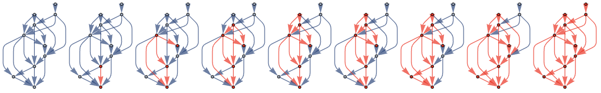

## Learn Mandarin
Learning Mandarin can be a daunting task. There are thousands characters to learn on top of the tens of thousands of words. Words are usually two characters long but the meanings of words are only heuristically related to their characters. Plus the meanings of the characters themselves can also be complex and nebulous at first.  A judicious choice of the order to learn characters turns out to greatly smooth the learning process. 


## The Main Idea


The set of characters and words in Mandarin can be thought of as a directed graph. Characters are the vertices and the pairs of characters which form words are edges. A learner of mandarin vocabulary is exploring this graph. 

Some characters and words are more frequently used and more relevant to learn than others. The relative importance of characters and words can be thought of as a weighting of vertices and edges. Our task as the learner now becomes clear: build and expand the subgraph of known characters and edges prioritizing those with the highest weight. 

## The Approach

One approach is to learn characters on-by-one in order of usage frequency and concurrently learn all words which are combinations of those characters. This approach has two main advantages.

1) More common characters are learned first. The words these characters form are often more commonly used too.
2) New vocabulary only ever involves at most one new character - usually in combination with a known character.


This app organizes learning in this way. Characters are listed on an index page in order from most common to least common. Each character links to a page which displays the character's pronunciation and definition. This page also displays the set of words which can be formed with the current character combined with ones already learned. The user can also mark characters as known or unknown to keep track of progress. This is then indicated by the color the character in the UI in all places in the app for quick reference. 


## Internals 

Each edge and node has associated information such as definition, pronunciation, and frequency rank (how commonly a character or word is typically used in Mandarin). 

This structure is implemented with the Character and Word models. The Character model has fields to store the character's standard symbol, frequency rank, definition, and pin1yin1 pronunciation. What character combinations form words is handled as a non-symmetrical many-to-many relationship from the character model to it's self through the Word model. The Word model also has additional fields for the word's frequency rank, definition and pin1yin1 pronunciation. The app tracks which characters a user reports to have successfully learned using a many-to-many relationship between the Character model and the Django User model.


For example
```
 char1 = Character(symbol="中", rank=14, definition="center/middle", pronunciation="zhong1")
 char2 = Character(symbol="国", rank=20, definition="country/state/nation", pronunciation="guo2")
 char3 = Character(symbol="美", rank=151, definition="beautiful", pronunciation="mei3")

 char1.save()
 char2.save()
 char3.save()
```

instantiates and save three instance of the Character model for 中, 国, and 美. You can now create words from these characters.

```
word1 = Word(first_char=char1, second_char=char2, rank = 124, definition="China", pronunciation="zhong1guo2")
word2 = Word(first_char=char2, second_char=char2, rank = 253, definition="the USA", pronunciation="mei3guo2")
```

Now you have defined the two words, 中国 and 美国.


If you want the list of all characters which can from a word starting with 中, run
```
char1.points_to.all()
```
In this example this will return
```
<QuerySet [ <Character: 国>]>
```

If you want the list of all characters which form a valid word ending with a character - in this case 国 - run

```
char2.character_set.all()
```
This will return
```
<QuerySet [ <Character: 中>, <Character: 美>]>
```
since we have defined two words which end with 国. 

It is possible to filter results based on fields in character using Django's built in APIs. For example 

```
char2.character_set.filter(rank__range = (0, char2.rank))
```
will only return
```
<QuerySet [ <Character: 中>]>
```
Since char2's rank is outside the specified range.


If there are users with established knowledge of characters and you want the QuerySet of Users who know a character, run
```sh
<some character>.known_by.all()
```

If you want the set of characters a particular user knows run
```sh
<some user>.character_set.all() 
```


## Installation
After pulling the project folders cd into the mandarin_vocab_builder folder and run the following commands:

*set up and activate venv*
```sh
python3 -m venv testenv
source testenv/bin/activate
```
*install django*
```sh
python -m pip install django
```
*set up database*
```sh
python manage.py makemigrations graph_builder
python manage.py migrate
```
*populate tables -- may take minute or two*
```sh
python manage.py shell < scripts/populate_tables.py 
```
*start server*
```sh
python manage.py runserver
```

## Using App
- Surf to localhost:8000/mandarin-graph/dashboard/
- Click "Login"
- Click "Register" to make a user account and follow directions. Once the user account is created the site will take you back to the dashboard page 
- Click "Character Index Page >". You may click on characters to see their pages and set them as known or unknown within the context of the just-created user account. 
- Each character's character page has a clickable large image of the character which links to the characgter's purpleculter page for more info. The links, desplayed as arrows "- ->" are also clickable at take you to the corosponding word's purplecutler page for a defintion and more information. 


